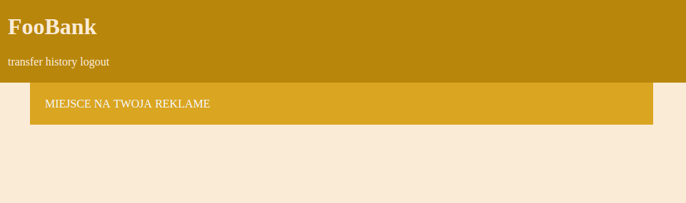

# XSS(Cross Site Scripting) wykorzystujące `autoescape off` w history.html template

## Scenariusz użycia:
Wykorzystując np. dodatek do przeglądarki z listy 4, atakujący mógłby zamiast tytułu przelewu umieścić skrypt, który wykona jakąś akcję w przeglądarce zaatakowanego użytkownika, gdy ten wyświetli historię swoich przelewów. W ten sposób wystarczy raz wprowadzić taki kod do bazy, a następnie złośliwy dodatek może zostać usunięty lub zdezaktywowany.

Mniej obeznani z technologią i bezpieczeństwem użytkownicy, mogą dostać np. złośliwy kod jako wymgany tytuł przelewu w jakimś serwisie e-commerce, który sami władują do bazy danych.

Atakujący może również wykorzystać słabe zabezpieczenia strony, aby władować do bazy danych skrypt jako tytuł przelewu, który zostanie uruchomiony przez administratora, gdy ten będzie przeglądać bazę danych z poziomu przeglądarki. W ten sposób może podłożyć kod, wymagający uprawnień administratora.

## Przykłady:
1. W tym wypadku sami, jako tytuł przelewu wpisujemy
```
<script>document.getElementById("history").innerHTML="MIEJSCE NA TWOJA REKLAME"</script>
```
Następnie zatwierdzamy przelew, aby już przy potwierdzeniu ujrzeć taki efekt:

Ten przykład oczywiście jest prosty, a jego scenariusz raczej mało prawdopodobny, ale pokazuje jak działa XSS.
Zamiast skryptu zmieniającego treść strony, może się tam pojawić skrypt wykonujący zapytanie POST na innej stronie, wysyłające dane z przeglądarki użytkownika, jego sesji lub ciasteczek.

2. Gdy pod do bazy zostanie podstawiony tag `img` z parametrem `"src="http://localhost:8000/bank/admin/confirm_all/"`
administrator przegladając bazę danych wywoła zapytanie zatwierdzające wszystkie przelewy, które wymaga uprawnień administratora.
```

```
